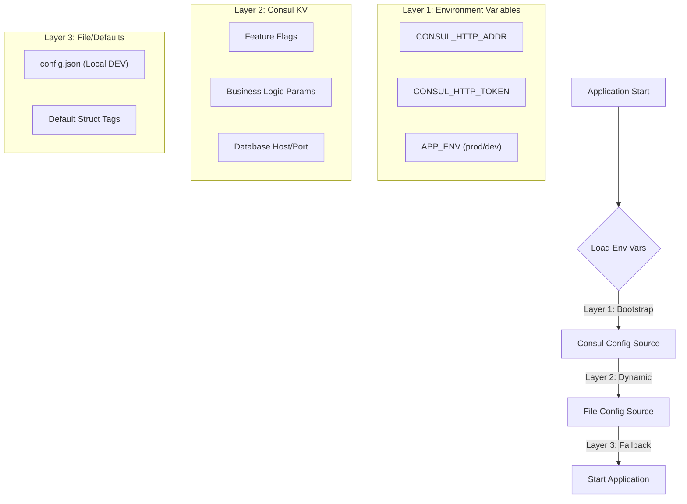

# Consul Configuration Strategy & Best Practices

## Executive Summary

This document outlines the recommended strategy for implementing centralized configuration management using HashiCorp Consul KV and the existing `framework/config` module. It proposes a **3-Layer Configuration Architecture** that balances security, flexibility, and developer experience.

## 1. Architectural Strategy: The 3-Layer Configuration

We recommend a tiered approach where configuration sources cascade from most static/secure to most dynamic.



### The Layers

1.  **Layer 1: Environment Variables (The Bootstrap)**
    *   **Purpose**: Bootstrapping connectivity. The app needs to know *how* to connect to Consul before it can read from it.
    *   **Attributes**: Immutable, injected by orchestrator (K8s/Docker).
    *   **Keys**: `CONSUL_HTTP_ADDR`, `CONSUL_HTTP_TOKEN`, `APP_ENV`.

2.  **Layer 2: Consul KV (The Dynamic Core)**
    *   **Purpose**: The single source of truth for runtime configuration.
    *   **Attributes**: Dynamic, Centralized, Supports live updates (via Watchers, if implemented).
    *   **Keys**: `log_level`, `database.host`, `cache.ttl`.

3.  **Layer 3: File/Defaults (The Fallback)**
    *   **Purpose**: Developer experience and safety nets.
    *   **Attributes**: Static, often committed to git (for default values).
    *   **Use Case**: A developer running locally without a Consul connection falls back to `config.json`.

---

## 2. Key-Value Structure Design

A hierarchical key structure allows for granular management and inherits the natural structure of your Go structs (`mapstructure`).

### Recommended Structure

We recommend the **Granular Split** approach over storing monolithic JSON blobs.

**Pattern**: `config/<service_name>/<environment>/<category>/<key>`

```text
config/
  ├── global/                  # Shared Configuration
  │    └── log_level           # Value: "info"
  │
  └── users/                   # Service-Specific Configuration
       ├── dev/
       │    ├── database/
       │    │    ├── host      # Value: "localhost"
       │    │    └── port      # Value: "5432"
       │    └── feature_flags/
       │         └── new_ui    # Value: "true"
       │
       └── prod/
            ├── database/
            │    ├── host      # Value: "db-prod.internal"
            │    └── port      # Value: "5432"
            └── feature_flags/
                 └── new_ui    # Value: "false"
```

### Why Hierarchical?
*   **Atomic Updates**: You can change a single timeout value without re-uploading (and potentially breaking) a massive JSON config file.
*   **Framework Compatibility**: Your `KVSource` reads recursively. If you point it at `config/users/prod/`, it gets a map:
    ```json
    {
      "database/host": "db-prod.internal",
      "database/port": "5432"
    }
    ```
    Your mapper converts this to `database.host`, which `mapstructure` maps to:
    ```go
    type Config struct {
        Database struct {
            Host string `config:"database.host"`
        }
    }
    ```

---

## 3. Implementation Plan

Using your existing `framework/config`, wiring this up is straightforward.

### Configuration struct
```go
type Config struct {
    Server   ServerConfig   `config:"server"`
    Database DatabaseConfig `config:"database"`
}
```

### Wiring in `cmd/serve.go`

```go
func ProvideConfig() (*Config, error) {
    var cfg Config
    
    appName := "users"
    env := os.Getenv("APP_ENV") // e.g., "prod"
    consulAddr := os.Getenv("CONSUL_HTTP_ADDR")
    consulToken := os.Getenv("CONSUL_HTTP_TOKEN")
    
    // Calculate the KV prefix
    // Example: "config/users/prod/"
    kvPrefix := fmt.Sprintf("config/%s/%s/", appName, env)
    
    // Drop segments to normalize keys
    // "config/users/prod/database/host" -> "database.host"
    // Segments to drop: "config", "users", "prod" = 3
    kvMapper := config.KVDefaultMapper(3)

    err := config.ReadInConfig(context.Background(), &cfg,
        config.WithSources(
            // 1. Environment Variables (Highest Priority overrides)
            config.EnvSource("APP_", config.DefaultEnvMapper()),
            
            // 2. Consul KV (Primary Source)
            config.KVSource(kvPrefix, config.ConsulClient(consulAddr, consulToken), kvMapper),
            
            // 3. Local File (Fallback/Local Dev)
            config.FileSource("config/config.json"),
        ),
        // Resolvers for secrets or references
        config.WithResolvers(
            config.EnvResolver(),
            // config.VaultResolver(...) // If integrating Vault
        ),
    )
    
    return &cfg, err
}
```

---

## 4. Security Best Practices

### A. Secret Management
**Recommendation**: **Do not** store high-entropy secrets (DB Passwords, Private Keys) in Consul KV if possible. Use HashiCorp Vault.

*   **If you MUST use Consul**:
    *   Use a separate path prefix: `secret/users/prod/...`
    *   Enable strict ACLs (see below).
    *   **Crucial**: Ensure `CONSUL_HTTP_ADDR` uses `https://`. Since Consul KV operations are HTTP requests, a plain HTTP connection exposes all your config (including potential secrets) in plaintext on the wire.

### B. Access Control Lists (ACLs)
Implement the **Principle of Least Privilege**.

1.  **Agent Token**: The backend service should have a token with **Read-Only** access to its specific path.
    ```hcl
    # Consul Policy: users-read-only
    key_prefix "config/users/" {
      policy = "read"
    }
    key_prefix "config/global/" {
      policy = "read"
    }
    ```
2.  **Write Access**: Only CI/CD pipelines (e.g., GitHub Actions, Jenkins) or System Admins should have tokens with `write` capabilities.

### C. Fallback Safety
Ensure your application can fail gracefully or refuse to start if Consul is unreachable (depending on strictness requirements).
*   **Soft Fail**: If Consul is down, log an error and use the `FileSource` or defaults. (Good for resilience).
*   **Hard Fail**: If config is missing, panic. (Good for preventing misconfigured deployments).

Your `KVSource` implementation currently returns an error if the fetch fails. You may want to wrap it in a logic that decides whether to suppress that error based on an `Optional: true` flag if you want Soft Fail behavior.
