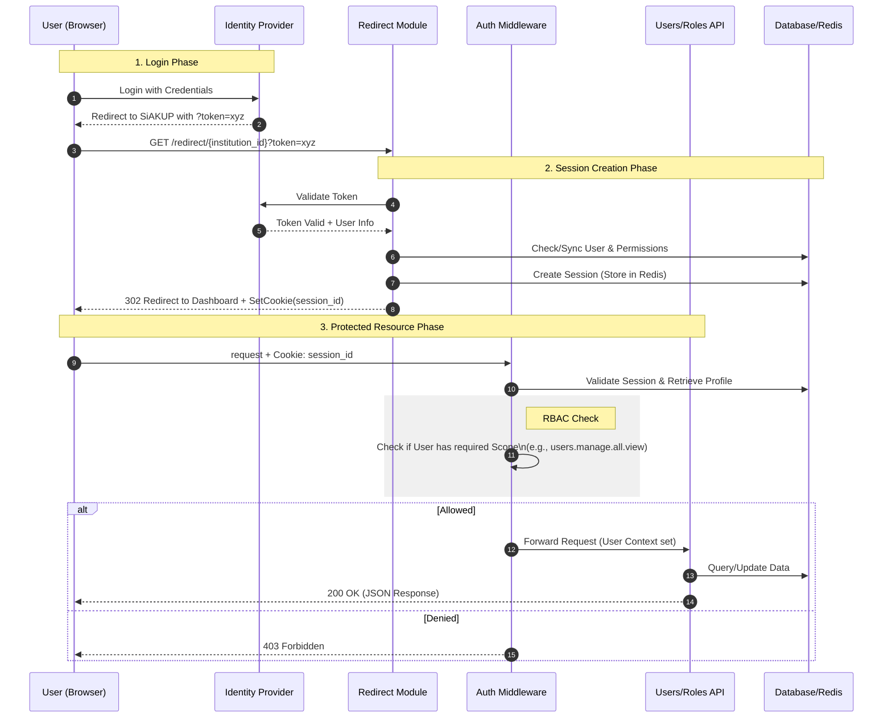

# End-to-End Authentication & RBAC Flow

This document details the complete flow from User Login (via IDP) to accessing protected resources within the Users and Roles modules.

## Overview

The system uses a **Session-Based Authentication** mechanism initiated by an external Identity Provider (IDP). Once authenticated, the user receives a session cookie which is used to authorize subsequent requests to the API.

## Workflow Diagram

## Detailed Steps

### 1. Redirect Module (Authentication)

This module handles the callback from the Central IDP.

*   **Endpoint**: `GET /redirect/{institution_id}`
*   **Parameters**:
    *   `institution_id` (Path): The target institution context.
    *   `token` (Query): The ephemeral access token provided by the IDP.
*   **Process**:
    1.  Receives `token`.
    2.  UseCases validate the token with IDP.
    3.  Syncs local user data (if needed).
    4.  Generates a secure `session_id`.
    5.  Sets `HTTPOnly` Cookie.
    6.  Redirects browser to the Frontend Dashboard URL.

### 2. Authorization Middleware

All protected routes in `Users` and `Roles` modules are guarded by this middleware.

*   **Function**: `Authenticate(required_scope string)`
*   **Process**:
    1.  Extracts `session_id` from Cookie.
    2.  Retrieves Session Data (User ID, Roles, Permissions) from Redis.
    3.  **Scope Check**: Compares the route's `required_scope` (e.g., `users.manage.all.edit`) against the user's permission list.
    4.  Injects `UserContext` into the request context for the handler.

### 3. Usage of Modules

Once authenticated, users interact with these modules based on their assigned roles.

#### A. Users Module
Manage user lifecycles and assignments.

| Action | Endpoint | Method | Required Scope | Description |
| :--- | :--- | :--- | :--- | :--- |
| **List Users** | `/users` | `GET` | `users.manage.all.view` | View all users, search, pagination. |
| **Sync User** | `/users` | `POST` | `users.manage.all.edit` | Manually sync a user from IDP. |
| **Update Status** | `/users/{id}/status` | `PATCH` | `users.manage.all.edit` | Activate/Deactivate a user. |
| **Assign Roles** | `/users/{id}/roles` | `POST` | `users.manage.all.edit` | Assign RBAC roles to a user. |

#### B. Roles Module
Define what users can do via RBAC.

| Action | Endpoint | Method | Required Scope | Description |
| :--- | :--- | :--- | :--- | :--- |
| **List Roles** | `/roles` | `GET` | `roles.manage.all.view` | View available roles. |
| **Create Role** | `/roles` | `POST` | `roles.manage.all.edit` | Create a new role with permissions. |
| **Update Role** | `/roles/{id}` | `PUT` | `roles.manage.all.edit` | Modify role permissions/name. |
| **Delete Role** | `/roles/{id}` | `DELETE` | `roles.manage.all.edit` | Remove a role. |
| **List Permissions** | `/roles/permissions` | `GET` | `roles.manage.all.view` | View all available system permissions. |
